# Hi Google- Google SignIn Made Easy


[**Hi Google**](https://github.com/shivam301296/HiGoogle)  is a powerful & easy to use lib for Android. It runs on [API level 14](http://developer.android.com/guide/topics/manifest/uses-sdk-element.html#ApiLevels) and upwards. 
This library helps you to add Google Sign In option in your app with few lines of code. and also Guide you to the process of registering your app to Google Cloud.

:zap:**A few line of code can add a Google Sign In in your app.** :zap:


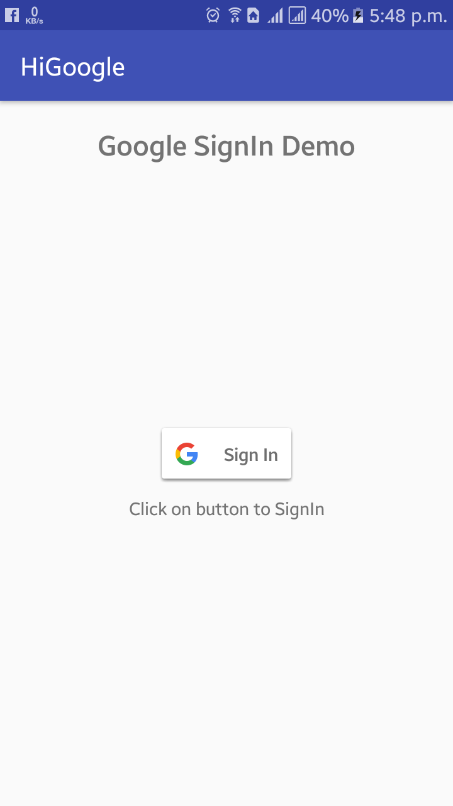</img>
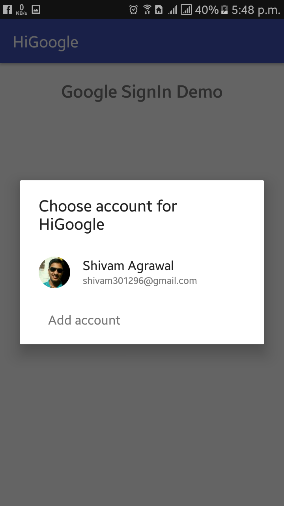</img>
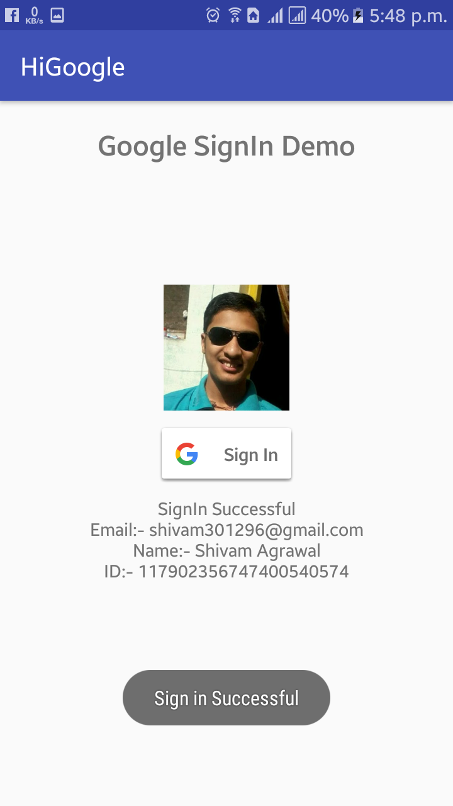</img>


Setup
-----

**Gradle dependency (recommended)** 

  -  Add the following to your project level `build.gradle`:
 
```gradle
allprojects {
	repositories {
		maven { url "https://jitpack.io" }
	}
}
```
  -  Add this to your app `build.gradle`:
 
```gradle
dependencies {
	compile 'com.github.shivam301296:HiGoogle:1.0.0'
}
```

**Or use Maven**
- Add the following to the `<repositories>` section of your `pom.xml`:

 ```xml
<repository>
        <id>jitpack.io</id>
        <url>https://jitpack.io</url>
</repository>
```
- Add the following to the `<dependencies>` section of your `pom.xml`:

 ```xml
<dependency>
        <groupId>com.github.shivam301296</groupId>
	      <artifactId>HiGoogle</artifactId>
	      <version>1.0.0</version>
</dependency>
```

# Documentation

Adding Google SignIn button in your app involves two tasks
1. Register your app on Google Cloude Plateform
2. Programming in Android Studio or else


## Register Your App on Google Cloud

(1) Go to [**this link**](https://developers.google.com/mobile/add?platform=android&cntapi=signin&cnturl=https:%2F%2Fdevelopers.google.com%2Fidentity%2Fsign-in%2Fandroid%2Fsign-in%3Fconfigured%3Dtrue&cntlbl=Continue%20Adding%20Sign-In)

(2) Fill your app name and package name

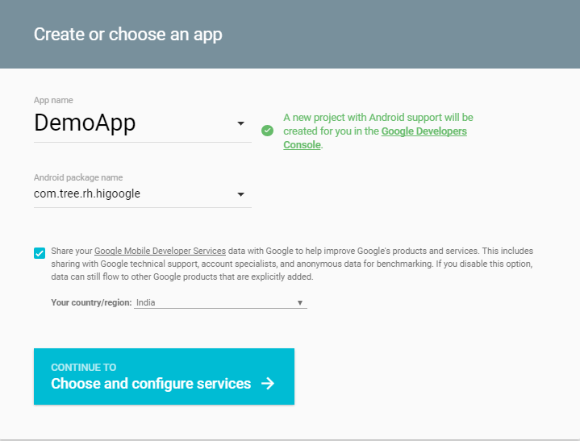</img>

(3) Next it will ask for SHA1 Certificate. For getting SHA1 Certificate for your app, In your Android Studio
Right Side (vertical) 
**Gradle> Project Name> Project Name(root)> Tasks> android> signingReport (double click)**

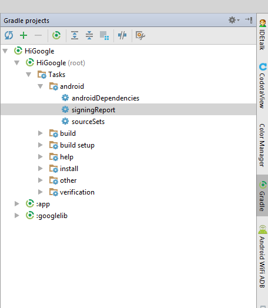</img>

(4) It will generate Signin report. Copy the SHA1 Certificate from it

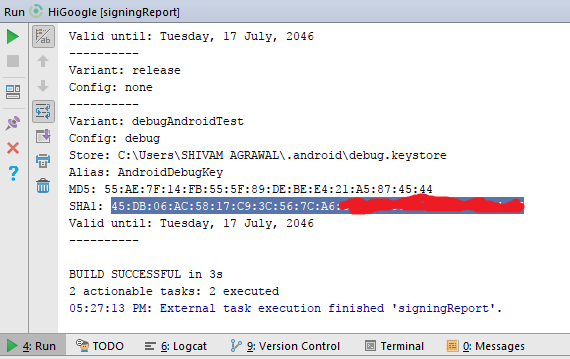</img>

(5) Fill this SHA1 Certificate in the form and click Generate Configuration file

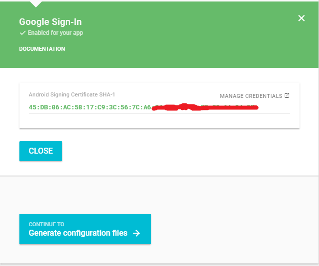</img>

(6) Download 'google-services.json' file

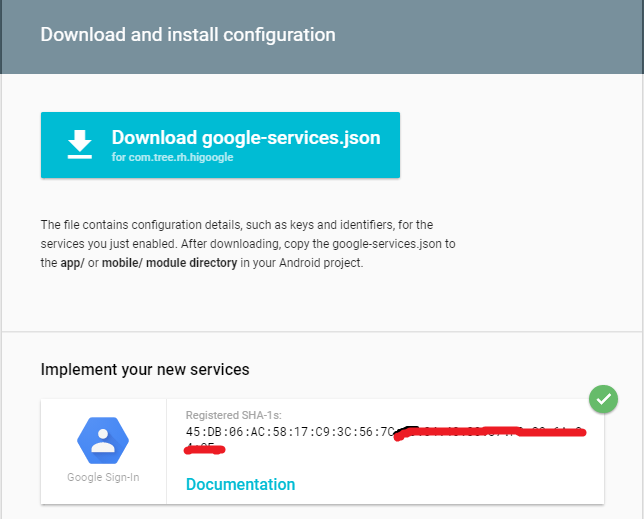</img>

(7) Paste this file in Android Studio
First Switch to Project View
**Project Name> app> (Paste here)**

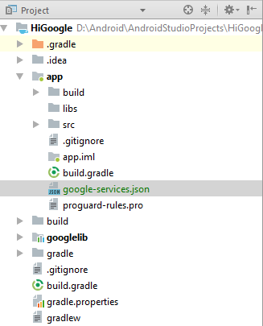</img>

DONE


## IN YOUR APP

### Add SignIn Button in design xml file
```
<com.google.android.gms.common.SignInButton
        android:layout_width="wrap_content"
        android:layout_height="wrap_content"
        android:id="@+id/googleSignInB"
        android:layout_centerInParent="true"/>
```
	
## In your Activity class

(1) Define hiGoogle globally
```
HiGoogle hiGoogle;
SignInButton signInButton;
```
(2) Initilize it in onCreate method
```
signInButton = findViewById(R.id.googleSignInB);
hiGoogle = new HiGoogle(this, this);  			//Normally recommanded
hiGoogle = new HiGoogle(this, this, accessToken);	//If require Token id 
```
(3) On signIn button click, call signIn method
```
signInButton.setOnClickListener(new View.OnClickListener() {
            @Override
            public void onClick(View v) {
                hiGoogle.signIn(new OnLoginListener() {
                    @Override
                    public void onSuccess(GoogleSignInAccount account) {
                        display("Sign in Successful");
                        tv.setText("SignIn Successful");
                        tv.append("\nEmail:- " + account.getEmail());
                        tv.append("\nName:- " + account.getDisplayName());
                        tv.append("\nID:- "+account.getId());
                        //Need to add Glide Dependency and INTERNET permission
                        //Glide.with(getApplicationContext()).load(account.getPhotoUrl()).into(profileIv);
                    }
                    @Override
                    public void onFailed(String why) {
                        display("Sign in failed");
                        tv.setText("Sign in failed due to:- \n"+why);
                    }
                });
            }
        });
```

(4) Override onActivityResult in your activity and call hiGoogle.fromActivityResult(...) method from inside
```
@Override
    protected void onActivityResult(int requestCode, int resultCode, Intent data) {
        super.onActivityResult(requestCode, resultCode, data);
        hiGoogle.fromActivityResult(requestCode, data);
    }
```
 
 DONE
 
### Troubleshoot
(1) Problem while running applicaiton (Change from signingReport to Run)

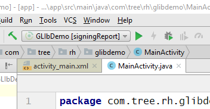</img> ***==>***  </img>

(2) Not able to find package name (Go to AndroidManifest.xml)

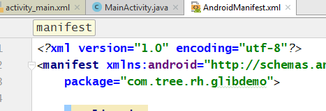</img>

#### Works on
* Android 4.0.1 (Ice Cream Sandwich) and above.

### Permissions
* Does not require any special permission

### Built With

* [Android Studio](https://developer.android.com/studio/index.html) - The Official IDE for Android

### Third party libraries
* No external library dependency

### Authors

* **Shivam Agrawal** - [Rising Hope](http://risinghopeapps.weebly.com/)

### Version 
* Version 1.0.0

## License 
* see [LICENSE](/LICENSE) file

## Sorry Albert Einstein Ji
You had said- “Make things as simple as possible, but no simpler.”
and this lib is simpler.

